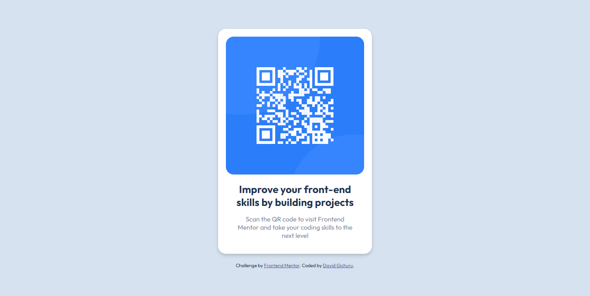
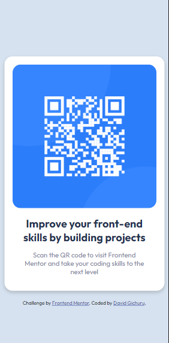

# Frontend Mentor - QR code component solution

This is a solution to the [QR code component challenge on Frontend Mentor](https://www.frontendmentor.io/challenges/qr-code-component-iux_sIO_H). Frontend Mentor challenges help you improve your coding skills by building realistic projects. 

## Table of contents

- [Overview](#overview)
  - [Screenshot](#screenshot)
- [My process](#my-process)
  - [Built with](#built-with)
  - [What I learned](#what-i-learned)
  - [Continued development](#continued-development)
  - [Useful resources](#useful-resources)
- [Author](#author)
- [How to build and view it](#How-to-build)

### Overview

This one was fairly simple. It is the appropriate size no matter the screen size of the device it is viewed on. It didn't need any media queries or advanced use of CSS. I like the simplicity of the design and it took me a relatively shor amunt of time to complete. I tried to get as close to the design as possible and I can sya I'm 99% there. I'm looking forward to simple challanges like this one since they help to keep your skills sharp.

### Screenshot

Desktop

Mobile

### Built with

- [React](https://reactjs.org/) - JS library

### What I learned

I learned how to build a simple project with react though I'm still in the dark about how to properly deploy it.

### Useful resources

- [Youtube](https://www.youtube.com/@KevinPowell) - This is where I found the best tutorials and explanations (For me) on CSS concepts and      writing functional CSS. This guy really knows his stuff and gives concise explanations.
- [w3schools](https://w3schools.com) - This website has an entire course on CSS with simple examples for both basic and advanced concepts.
- [CSS Tricks](https://css-tricks.com/) - This website provide very well written explanations to CSS concepts as well as examples for when you need to revisit a concept.
- [Vite](https://vitejs.dev/) - The tool I used to create a local project.

## Author

- Frontend Mentor - [@dxiDavid](https://www.frontendmentor.io/profile/dxiDavid)
- Twitter - [@dxidavid254](https://www.twitter.com/dxidavid254)

### How to build it with npm

[Guide](https://vitejs.dev/guide/static-deploy.html)
