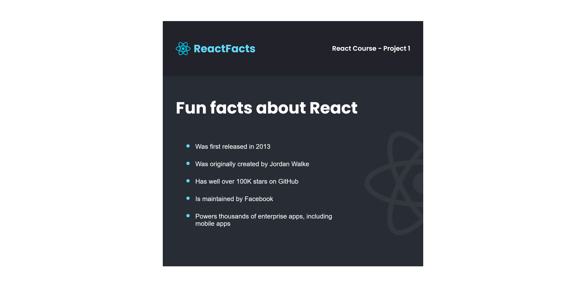

# Scrimba React challenge

This is a completed challenge from Scrimba that covers the basics of React

## Table of contents

- [Overview](#overview)
  - [Screenshot](#screenshot)
  - [Built with](#built-with)
  - [What I learned](#what-i-learned)
  - [Useful resources](#useful-resources)
- [Author](#author)
- [How to build and view it](#How-to-build)

### Overview

This was just an exercise to test whether I've grasped some basic concepts of React. It is not responsive!

### Screenshot

Desktop

### Built with

- [React](https://reactjs.org/) - JS library

### What I learned

I learned how to style the bullets in unorederd lists by using the ``::marker`` pseudo selector

### Useful resources

- [Vite](https://vitejs.dev/) - The tool I used to create a local project.

## Author

- Frontend Mentor - [@dxiDavid](https://www.frontendmentor.io/profile/dxiDavid)
- Twitter - [@dxidavid254](https://www.twitter.com/dxidavid254)

### How to build it with npm

[Guide](https://vitejs.dev/guide/static-deploy.html)
